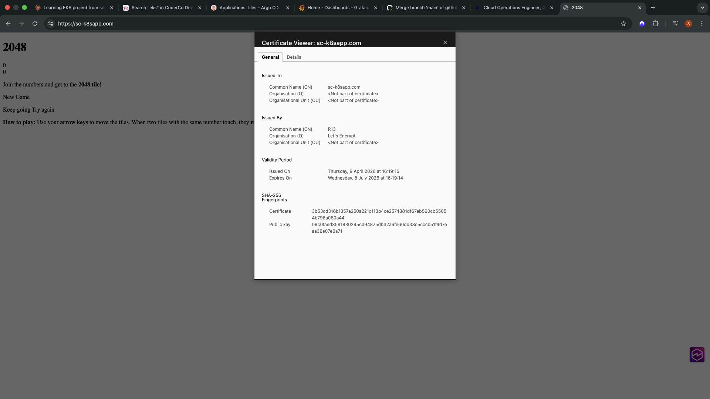
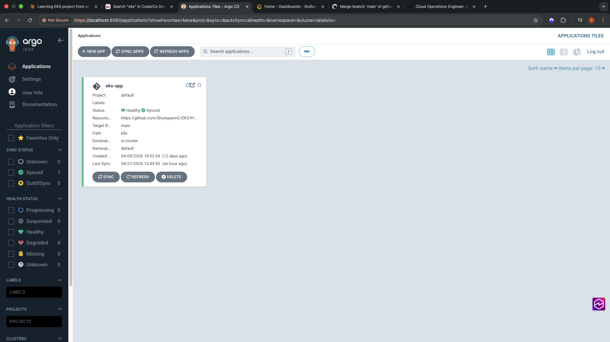
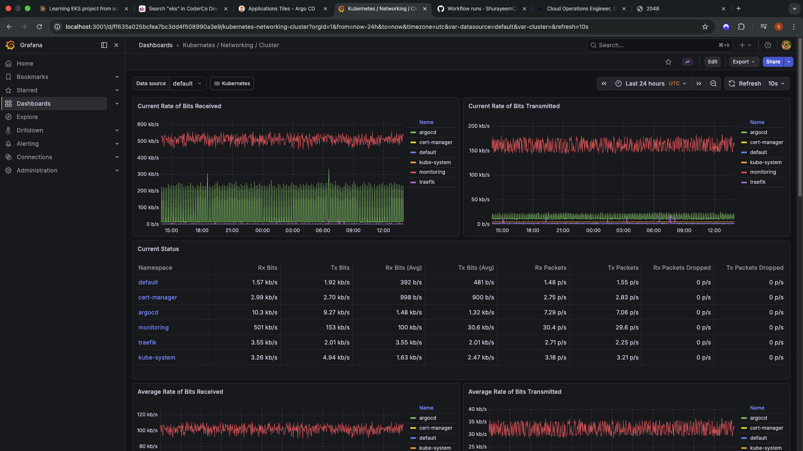
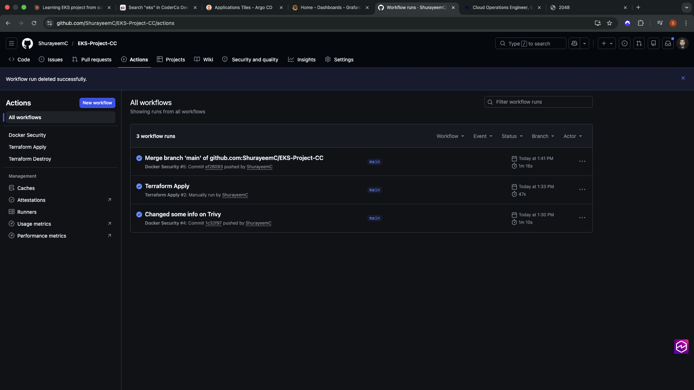

# EKS Project - Cloud-Native Platform Engineering

A production-grade Kubernetes deployment on Amazon EKS demonstrating end-to-end Platform Engineering skills across infrastructure provisioning, container orchestration, GitOps, security scanning, observability, and automated CI/CD.

**🌐 Live URL:** [https://sc-k8sapp.com](https://sc-k8sapp.com)

---

## 📋 Table of Contents

1. [📊 Overview](#-overview)
2. [🛠️ Prerequisites](#️-prerequisites)
3. [📁 Repository Structure](#-repository-structure)
4. [🏗️ Infrastructure Provisioning](#️-infrastructure-provisioning)
5. [🔗 Connecting to the Cluster](#-connecting-to-the-cluster)
6. [🚀 Deploying the Application](#-deploying-the-application)
7. [🔄 GitOps with ArgoCD](#-gitops-with-argocd)
8. [📊 Monitoring](#-monitoring)
9. [⚙️ CI/CD Pipelines](#️-cicd-pipelines)
10. [🏛️ Architecture](#️-architecture)

---

## 📊 Overview

This project showcases a comprehensive cloud-native platform engineering solution using modern DevOps practices and tools.

### 🛠️ Technology Stack

| Category | Tools |
|---|---|
| **Cloud Provider** | AWS (EKS, ECR, VPC, IAM, Route 53) |
| **Infrastructure as Code** | Terraform (modular architecture) |
| **Ingress Controller** | Traefik |
| **Certificate Management** | CertManager + Let's Encrypt |
| **DNS Automation** | ExternalDNS + IRSA |
| **GitOps** | ArgoCD |
| **Monitoring & Observability** | Prometheus + Grafana |
| **CI/CD** | GitHub Actions with OIDC |
| **Security Scanning** | Checkov + Trivy |
| **Container Registry** | Amazon ECR |
| **Auto Scaling** | HPA + Metrics Server |
| **Security** | Network Policy + Rate Limiting |

---

## 🛠️ Prerequisites

Ensure you have the following tools installed and configured before starting:

### Required Tools

- **AWS CLI** - configured with appropriate credentials
- **Terraform** >= 1.5
- **kubectl** - Kubernetes command-line tool
- **Helm** >= 3.0 - Kubernetes package manager

### AWS Requirements

- AWS account with permissions to create:
  - EKS clusters
  - VPC resources
  - IAM roles and policies
  - ECR repositories
  - Route 53 hosted zones
- A registered domain (this project uses `sc-k8sapp.com` via Cloudflare)

### GitHub Configuration

- GitHub repository with `AWS_ROLE_ARN` secret configured for OIDC authentication

### Verification

Verify your AWS credentials are working:

```bash
aws sts get-caller-identity
```

---

## 📁 Repository Structure

```
EKS-Project-CC/
├── infrastructure/                   # Terraform Infrastructure as Code
│   ├── main.tf                      # Root Terraform module
│   ├── providers.tf                 # AWS, Kubernetes, Helm providers
│   ├── backend.tf                   # Remote state (S3 + DynamoDB)
│   ├── variables.tf                 # Input variables
│   ├── outputs.tf                   # Output values
│   ├── bootstrap/                   # Bootstrap infrastructure (ECR)
│   │   ├── ecr.tf                   # ECR repository configuration
│   │   ├── backend.tf               # Bootstrap state backend
│   │   └── variables.tf             # Bootstrap variables
│   └── modules/                     # Modular Terraform components
│       ├── vpc/                     # VPC, subnets, IGW, NAT, route tables
│       ├── iam/                     # EKS roles, node roles, ExternalDNS IRSA
│       ├── eks/                     # EKS cluster and node group
│       ├── securitygroups/          # Control plane and node security groups
│       └── route53/                 # DNS hosted zone configuration
├── k8s/                             # Kubernetes manifests
│   ├── deployment.yaml              # Application deployment with topology spread
│   ├── svc.yaml                     # Kubernetes service
│   ├── ingress.yaml                 # Ingress configuration
│   ├── clusterissuer.yaml           # Let's Encrypt certificate issuer
│   ├── pdb.yaml                     # Pod Disruption Budget
│   ├── hpa.yaml                     # Horizontal Pod Autoscaler
│   ├── networkpolicy.yaml           # Network security policies
│   └── middleware.yaml              # Traefik rate limiting middleware
├── app/                             # Application source code and Dockerfile
│   ├── dockerfile                   # Container build configuration
│   ├── index.html                   # Application entry point
│   └── [other app files]           # Additional application resources
├── .github/                         # GitHub Actions workflows
│   └── workflows/
│       ├── docker-security.yml      # Security scanning and deployment
│       ├── terraform-apply.yml      # Infrastructure deployment
│       └── terraform-destroy.yml    # Infrastructure cleanup
└── README.md                        # Project documentation
```

---

## 🏗️ Infrastructure Provisioning

All AWS infrastructure is provisioned using Terraform with modular architecture. State is stored remotely in S3 with DynamoDB locking for team collaboration.

### Step 1: Initialize Terraform

```bash
cd infrastructure
terraform init
```

### Step 2: Review the Plan

```bash
terraform plan
```

### Step 3: Apply Infrastructure

```bash
terraform apply 
```

### 🏗️ Provisioned Resources

This creates the following AWS infrastructure:

- **VPC**: Custom VPC with public and private subnets across 2 Availability Zones
- **Networking**: Internet Gateway, NAT Gateway, and route tables
- **EKS Cluster**: Managed Kubernetes cluster with 2 worker nodes
- **IAM**: Roles for cluster, node group, and ExternalDNS (via IRSA)
- **Security Groups**: Properly configured for control plane and worker nodes
- **Route 53**: Public hosted zone for `sc-k8sapp.com`

### Step 4: Tear Down Infrastructure

```bash
terraform destroy -auto-approve
```

> **💡 Note on IRSA:** ExternalDNS uses IAM Roles for Service Accounts (IRSA) to authenticate to AWS without static credentials. An OIDC provider is registered in IAM and bound to the ExternalDNS Kubernetes Service Account, automatically granting scoped Route 53 permissions.

---

## 🔗 Connecting to the Cluster

### Update Local kubeconfig

After `terraform apply` completes successfully, update your local kubeconfig:

```bash
aws eks update-kubeconfig --region eu-west-2 --name SC-EKS-Cluster
```

### Verify Cluster Connection

Check that the nodes are ready:

```bash
kubectl get nodes
```

**Expected output:**
```
NAME                                       STATUS   ROLES    AGE   VERSION
ip-10-0-3-169.eu-west-2.compute.internal   Ready    <none>   Xd    v1.35.x
ip-10-0-4-169.eu-west-2.compute.internal   Ready    <none>   Xd    v1.35.x
```


### Troubleshooting Access Issues

If you receive an `Unauthorized` error, create an access entry for your IAM user:

```bash
aws eks create-access-entry \
  --cluster-name SC-EKS-Cluster \
  --principal-arn arn:aws:iam::<account-id>:user/<your-user> \
  --region eu-west-2

aws eks associate-access-policy \
  --cluster-name SC-EKS-Cluster \
  --principal-arn arn:aws:iam::<account-id>:user/<your-user> \
  --policy-arn arn:aws:eks::aws:cluster-access-policy/AmazonEKSClusterAdminPolicy \
  --access-scope type=cluster \
  --region eu-west-2
```

---

## 🚀 Deploying the Application

### Step 1: Install Traefik (Ingress Controller)

```bash
helm repo add traefik https://traefik.github.io/charts
helm repo update
helm install traefik traefik/traefik \
  --namespace traefik \
  --create-namespace
```

**Verify Traefik installation:**

```bash
kubectl get pods -n traefik
kubectl get svc -n traefik
```

### Step 2: Install CertManager

```bash
helm repo add jetstack https://charts.jetstack.io
helm repo update
helm install cert-manager jetstack/cert-manager \
  --namespace cert-manager \
  --create-namespace \
  --set crds.enabled=true
```

**Verify CertManager installation:**

```bash
kubectl get pods -n cert-manager
```

### Step 3: Install ExternalDNS

Replace `<external-dns-role-arn>` with the ARN output from Terraform:

```bash
helm repo add external-dns https://kubernetes-sigs.github.io/external-dns/
helm repo update
helm install external-dns external-dns/external-dns \
  --namespace default \
  --set provider=aws \
  --set aws.region=eu-west-2 \
  --set "domainFilters[0]=sc-k8sapp.com" \
  --set serviceAccount.annotations."eks\.amazonaws\.com/role-arn"=<external-dns-role-arn> \
  --set policy=sync
```

**Verify ExternalDNS is working:**

```bash
kubectl logs -l app.kubernetes.io/name=external-dns
```

### Step 4: Apply the ClusterIssuer

```bash
kubectl apply -f k8s/clusterissuer.yaml
kubectl get clusterissuer
```

### Step 5: Install Metrics Server (for HPA)

```bash
kubectl apply -f https://github.com/kubernetes-sigs/metrics-server/releases/latest/download/components.yaml
```

**Verify metrics server is running:**

```bash
kubectl get pods -n kube-system | grep metrics-server
kubectl top nodes
```

### Step 6: Create Application Namespace

```bash
kubectl create namespace app
```

### Step 7: Deploy the Application

```bash
kubectl apply -f k8s/
```

**Verify all resources are healthy:**

```bash
kubectl get pods -n app
kubectl get svc -n app
kubectl get ingress -n app
kubectl get certificate -n app
kubectl get hpa -n app
kubectl get pdb -n app
kubectl get networkpolicy -n app
kubectl get middleware -n traefik
```

### Step 8: Wait for SSL Certificate

The certificate will initially show `READY: False` while Let's Encrypt validates the domain. Wait 2-3 minutes:

```bash
kubectl get certificate -w
```

Once `READY: True`, the application is accessible at `https://sc-k8sapp.com`.


*Live application running at https://sc-k8sapp.com with SSL certificate*

---

## 🔄 GitOps with ArgoCD

### Install ArgoCD

```bash
helm repo add argo https://argoproj.github.io/argo-helm
helm repo update
helm install argocd argo/argo-cd \
  --namespace argocd \
  --create-namespace
```

### Get Admin Password

```bash
kubectl -n argocd get secret argocd-initial-admin-secret \
  -o jsonpath="{.data.password}" | base64 -d
```

### Access ArgoCD UI

```bash
kubectl port-forward service/argocd-server -n argocd 8080:443
```

Open `http://localhost:8080` and login with:
- **Username:** `admin`
- **Password:** Retrieved from the previous command

### Create Application in ArgoCD

In the ArgoCD UI, create a new application with these settings:

| Setting | Value |
|---|---|
| **Application Name** | eks-app |
| **Project** | default |
| **Sync Policy** | Automatic |
| **Repository URL** | https://github.com/ShurayeemC/EKS-Project-CC |
| **Revision** | main |
| **Path** | k8s |
| **Cluster URL** | https://kubernetes.default.svc |
| **Namespace** | app |

ArgoCD will automatically sync the `k8s/` directory from GitHub and maintain cluster state. Any push to the `k8s/` directory triggers automatic reconciliation.


*ArgoCD application dashboard showing healthy sync status and deployed resources*

---

## 📊 Monitoring

### Install Prometheus and Grafana

```bash
helm repo add prometheus-community https://prometheus-community.github.io/helm-charts
helm repo update
helm install prometheus prometheus-community/kube-prometheus-stack \
  --namespace monitoring \
  --create-namespace
```

**Verify monitoring stack:**

```bash
kubectl get pods -n monitoring
```

### Access Grafana Dashboard

**Get Grafana admin password:**

```bash
kubectl --namespace monitoring get secrets prometheus-grafana \
  -o jsonpath="{.data.admin-password}" | base64 -d
```

**Port forward to access UI:**

```bash
kubectl --namespace monitoring port-forward svc/prometheus-grafana 3001:80
```

Open `http://localhost:3001` and login with username `admin` and the retrieved password.


*Grafana monitoring dashboard showing cluster metrics and performance*

> **🔧 Remote Access Note:** If accessing from a remote dev machine, use SSH tunneling:
> ```bash
> ssh -i ~/.ssh/id_ecdsa -L 3001:127.0.0.1:3001 <user>@<dev-machine-hostname>
> ```

### 📊 Pre-built Dashboards

| Dashboard | Description |
|---|---|
| **Kubernetes / Compute Resources / Cluster** | CPU and memory usage across all namespaces |
| **Kubernetes / Networking / Cluster** | Network traffic analysis per namespace |
| **Kubernetes / Compute Resources / Node (Pods)** | Per-node resource breakdown and utilization |
| **Kubernetes / Compute Resources / Pod** | Individual pod performance metrics |

---

## ⚙️ CI/CD Pipelines

All pipelines use OIDC authentication to AWS — no static credentials stored in GitHub Secrets.

### 🔒 `docker-security.yml` Pipeline

**Trigger:** Push to `main` branch

| Step | Description |
|---|---|
| **Checkov Scan** | Scans Terraform IaC for security misconfigurations |
| **Docker Build** | Builds container image tagged with git commit SHA |
| **Trivy Scan** | Scans image for CRITICAL vulnerabilities, fails on fixable issues |
| **ECR Push** | Pushes verified image to Amazon ECR |
| **ArgoCD Image Updater** | ArgoCD Image Updater automatically detects new ECR images and updates deployment |

### 🏗️ `terraform-apply.yml` Pipeline

**Trigger:** Manual (`workflow_dispatch`)

**Steps:** `terraform fmt -check` → `terraform validate` → `terraform plan` → `terraform apply -auto-approve`

### 🗑️ `terraform-destroy.yml` Pipeline

**Trigger:** Manual (`workflow_dispatch`)

**Steps:** `terraform init` → `terraform destroy -auto-approve`

### 🚀 Triggering Deployments

**Automatic:** Push any change to `main` branch to trigger the Docker Security pipeline

**Manual:** 
1. Navigate to GitHub repo > Actions
2. Select the desired workflow
3. Click **Run workflow**


*GitHub Actions workflow runs showing successful CI/CD pipeline executions*

---

## 🏛️ Architecture


### 🌐 Traffic Flow
```
User → Cloudflare DNS → AWS NLB → Traefik Ingress → ClusterIP Service → Application Pods
```

### 🔐 Certificate Management Flow
```
Ingress Annotation → CertManager → Let's Encrypt ACME Challenge → Certificate Issued → K8s Secret → Ingress TLS
```

### 📡 DNS Automation Flow
```
Ingress Created → ExternalDNS Detection → Route 53 Record Creation → DNS Propagation
```

### 🔄 GitOps Flow
```
Main Branch Push → GitHub Actions → Image Build & Push → Deployment Update → ArgoCD Sync → Cluster Deployment
```

---

