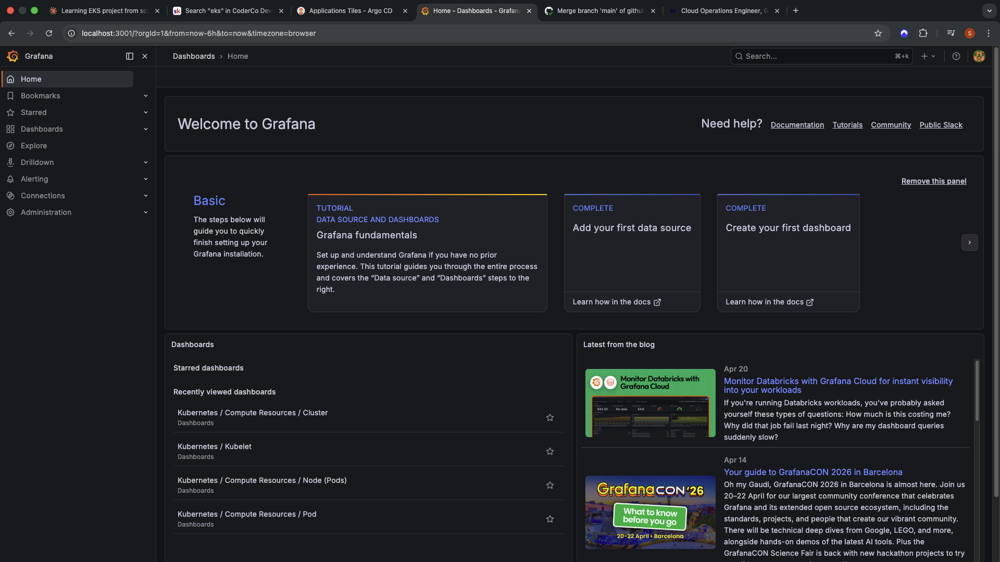

# A production-grade Kubernetes deployment on Amazon EKS demonstrating end-to-end Platform Engineering skills across infrastructure provisioning, container orchestration, GitOps, security scanning, observability, and automated CI/CD.

**Live URL:** [https://sc-k8sapp.com](https://sc-k8sapp.com)

---

## Table of Contents

1. [Overview](#overview)
2. [Prerequisites](#prerequisites)
3. [Repository Structure](#repository-structure)
4. [Infrastructure Provisioning](#infrastructure-provisioning)
5. [Connecting to the Cluster](#connecting-to-the-cluster)
6. [Deploying the Application](#deploying-the-application)
7. [GitOps with ArgoCD](#gitops-with-argocd)
8. [Monitoring](#monitoring)
9. [CI/CD Pipelines](#cicd-pipelines)
10. [Architecture](#architecture)
11. [Screenshots](#screenshots)

---

## Overview

| Category | Tools |
|---|---|
| Cloud | AWS (EKS, ECR, VPC, IAM, Route 53) |
| IaC | Terraform (modular) |
| Ingress | Traefik |
| Certificate Management | CertManager + Let's Encrypt |
| DNS Automation | ExternalDNS + IRSA |
| GitOps | ArgoCD |
| Monitoring | Prometheus + Grafana |
| CI/CD | GitHub Actions with OIDC |
| Security Scanning | Checkov + Trivy |
| Container Registry | Amazon ECR |

---

## Prerequisites

Before running this project ensure the following are installed and configured:

- AWS CLI configured with appropriate credentials
- Terraform >= 1.5
- kubectl
- Helm >= 3.0
- An AWS account with permissions to create EKS, VPC, IAM, ECR, and Route 53 resources
- A domain registered (this project uses `sc-k8sapp.com` via Cloudflare)
- GitHub repository with `AWS_ROLE_ARN` secret configured for OIDC authentication

Verify your AWS credentials are working:
```bash
aws sts get-caller-identity
```

---

## Repository Structure
EKS-Project-CC/
├── infrastructure/               # Terraform IaC
│   ├── main.tf                   # Root module
│   ├── providers.tf              # AWS, Kubernetes, Helm providers
│   ├── backend.tf                # Remote state (S3 + DynamoDB)
│   ├── variables.tf
│   ├── outputs.tf
│   └── modules/
│       ├── vpc/                  # VPC, subnets, IGW, NAT, route tables
│       ├── iam/                  # EKS roles, node roles, ExternalDNS IRSA
│       ├── eks/                  # EKS cluster and node group
│       ├── securitygroups/       # Control plane and node security groups
│       └── route53/              # Hosted zone
├── k8s/                          # Kubernetes manifests
│   ├── deployment.yaml
│   ├── svc.yaml
│   ├── ingress.yaml
│   └── clusterissuer.yaml
├── app/                          # Application source and Dockerfile
├── .github/
│   └── workflows/
│       ├── docker-security.yml
│       ├── terraform-apply.yml
│       └── terraform-destroy.yml
└── README.md

---

## Infrastructure Provisioning

All AWS infrastructure is provisioned via Terraform. State is stored remotely in S3 with DynamoDB locking.

### 1. Initialise Terraform

```bash
cd infrastructure
terraform init
```

### 2. Review the plan

```bash
terraform plan
```

### 3. Apply infrastructure

```bash
terraform apply -auto-approve
```

This provisions the following resources:

- VPC with public and private subnets across 2 Availability Zones
- Internet Gateway and NAT Gateway
- EKS cluster with 2 worker nodes
- IAM roles for the cluster, node group, and ExternalDNS (via IRSA)
- Security groups for the control plane and worker nodes
- Route 53 public hosted zone for `sc-k8sapp.com`

### 4. Tear down infrastructure

```bash
terraform destroy -auto-approve
```

> **Note on IRSA:** ExternalDNS uses IAM Roles for Service Accounts to authenticate to AWS without static credentials. An OIDC provider is registered in IAM and bound to the ExternalDNS Kubernetes Service Account, granting it scoped Route 53 permissions automatically.

---

## Connecting to the Cluster

After `terraform apply` completes, update your local kubeconfig:

```bash
aws eks update-kubeconfig --region eu-west-2 --name SC-EKS-Cluster
```

Verify the nodes are ready:

```bash
kubectl get nodes
```

Expected output:
NAME                                       STATUS   ROLES    AGE   VERSION
ip-10-0-3-169.eu-west-2.compute.internal   Ready    <none>   Xd    v1.35.x
ip-10-0-4-169.eu-west-2.compute.internal   Ready    <none>   Xd    v1.35.x

If you receive an `Unauthorized` error, create an access entry for your IAM user:

```bash
aws eks create-access-entry \
  --cluster-name SC-EKS-Cluster \
  --principal-arn arn:aws:iam::<account-id>:user/<your-user> \
  --region eu-west-2

aws eks associate-access-policy \
  --cluster-name SC-EKS-Cluster \
  --principal-arn arn:aws:iam::<account-id>:user/<your-user> \
  --policy-arn arn:aws:eks::aws:cluster-access-policy/AmazonEKSClusterAdminPolicy \
  --access-scope type=cluster \
  --region eu-west-2
```

---

## Deploying the Application

### 1. Install Traefik (Ingress Controller)

```bash
helm repo add traefik https://traefik.github.io/charts
helm repo update
helm install traefik traefik/traefik \
  --namespace traefik \
  --create-namespace
```

Verify Traefik is running and has an external load balancer:

```bash
kubectl get pods -n traefik
kubectl get svc -n traefik
```

### 2. Install CertManager

```bash
helm repo add jetstack https://charts.jetstack.io
helm repo update
helm install cert-manager jetstack/cert-manager \
  --namespace cert-manager \
  --create-namespace \
  --set crds.enabled=true
```

Verify CertManager pods are running:

```bash
kubectl get pods -n cert-manager
```

### 3. Install ExternalDNS

Replace `<external-dns-role-arn>` with the ARN output from Terraform:

```bash
helm repo add external-dns https://kubernetes-sigs.github.io/external-dns/
helm repo update
helm install external-dns external-dns/external-dns \
  --namespace default \
  --set provider=aws \
  --set aws.region=eu-west-2 \
  --set "domainFilters[0]=sc-k8sapp.com" \
  --set serviceAccount.annotations."eks\.amazonaws\.com/role-arn"=<external-dns-role-arn> \
  --set policy=sync
```

Verify ExternalDNS is creating DNS records:

```bash
kubectl logs -l app.kubernetes.io/name=external-dns
```

### 4. Apply the ClusterIssuer

```bash
kubectl apply -f k8s/clusterissuer.yaml
kubectl get clusterissuer
```

### 5. Deploy the application

```bash
kubectl apply -f k8s/
```

Verify all resources are healthy:

```bash
kubectl get pods
kubectl get svc
kubectl get ingress
kubectl get certificate
```

The certificate will initially show `READY: False` while Let's Encrypt validates the domain. Wait 2-3 minutes:

```bash
kubectl get certificate -w
```

Once `READY: True`, the application is accessible at `https://sc-k8sapp.com`.

---

## GitOps with ArgoCD

### Install ArgoCD

```bash
helm repo add argo https://argoproj.github.io/argo-helm
helm repo update
helm install argocd argo/argo-cd \
  --namespace argocd \
  --create-namespace
```

### Get the admin password

```bash
kubectl -n argocd get secret argocd-initial-admin-secret \
  -o jsonpath="{.data.password}" | base64 -d
```

### Access the ArgoCD UI

```bash
kubectl port-forward service/argocd-server -n argocd 8080:443
```

Open `http://localhost:8080` and login with username `admin` and the password retrieved above.

### Create the Application

In the ArgoCD UI create a new application with the following settings:

| Setting | Value |
|---|---|
| Application Name | eks-app |
| Project | default |
| Sync Policy | Automatic |
| Repository URL | https://github.com/ShurayeemC/EKS-Project-CC |
| Revision | main |
| Path | k8s |
| Cluster URL | https://kubernetes.default.svc |
| Namespace | default |

ArgoCD will sync the `k8s/` directory from GitHub and maintain the cluster state automatically. Any push to the `k8s/` directory triggers a reconciliation.

---

## Monitoring

### Install Prometheus and Grafana

```bash
helm repo add prometheus-community https://prometheus-community.github.io/helm-charts
helm repo update
helm install prometheus prometheus-community/kube-prometheus-stack \
  --namespace monitoring \
  --create-namespace
```

Verify all monitoring pods are running:

```bash
kubectl get pods -n monitoring
```

### Access Grafana

Get the Grafana admin password:

```bash
kubectl --namespace monitoring get secrets prometheus-grafana \
  -o jsonpath="{.data.admin-password}" | base64 -d
```

Port forward to access the UI:

```bash
kubectl --namespace monitoring port-forward svc/prometheus-grafana 3001:80
```

Open `http://localhost:3001` and login with username `admin`.

> **Note:** If accessing from a remote dev machine, an SSH tunnel is required:
> ```bash
> ssh -i ~/.ssh/id_ecdsa -L 3001:127.0.0.1:3001 <user>@<dev-machine-hostname>
> ```

### Pre-built dashboards

| Dashboard | Description |
|---|---|
| Kubernetes / Compute Resources / Cluster | CPU and memory across all namespaces |
| Kubernetes / Networking / Cluster | Network traffic per namespace |
| Kubernetes / Compute Resources / Node (Pods) | Per-node resource breakdown |
| Kubernetes / Compute Resources / Pod | Individual pod metrics |

---

## CI/CD Pipelines

All pipelines authenticate to AWS via OIDC — no static credentials are stored in GitHub Secrets.

### `docker-security.yml` — triggers on push to `main`

| Step | Description |
|---|---|
| Checkov scan | Scans Terraform IaC for security misconfigurations |
| Docker build | Builds image tagged with git commit SHA |
| Trivy scan | Scans image for CRITICAL vulnerabilities, fails if fixable ones found |
| ECR push | Pushes verified image to Amazon ECR |
| Git update | Updates image tag in `k8s/deployment.yaml` and commits back to trigger ArgoCD |

### `terraform-apply.yml` — manual trigger (`workflow_dispatch`)

Runs `terraform fmt -check` → `terraform validate` → `terraform plan` → `terraform apply -auto-approve`

### `terraform-destroy.yml` — manual trigger (`workflow_dispatch`)

Runs `terraform init` → `terraform destroy -auto-approve`

### Triggering a deployment manually

Push any change to `main` to trigger the Docker Security pipeline. To manually trigger Terraform:

1. Go to GitHub repo > Actions
2. Select the workflow
3. Click **Run workflow**

---

## Architecture


### Traffic flow
User → Cloudflare DNS → AWS NLB → Traefik → ClusterIP Service → App Pods

### Certificate flow
Ingress annotation → CertManager → Let's Encrypt ACME challenge → Certificate issued → Stored as Kubernetes Secret → Attached to Ingress

### DNS automation flow
Ingress created → ExternalDNS detects hostname → Route 53 record created automatically

### GitOps flow
Push to main → GitHub Actions builds and pushes image → Updates deployment.yaml → ArgoCD detects change → Deploys to cluster

---

## Screenshots

| Component | Screenshot |
|---|---|
| Application live at `https://sc-k8sapp.com` |  |
| ArgoCD showing Healthy and Synced |  |
| Grafana cluster networking dashboard |  |
| GitHub Actions successful pipeline runs |  |